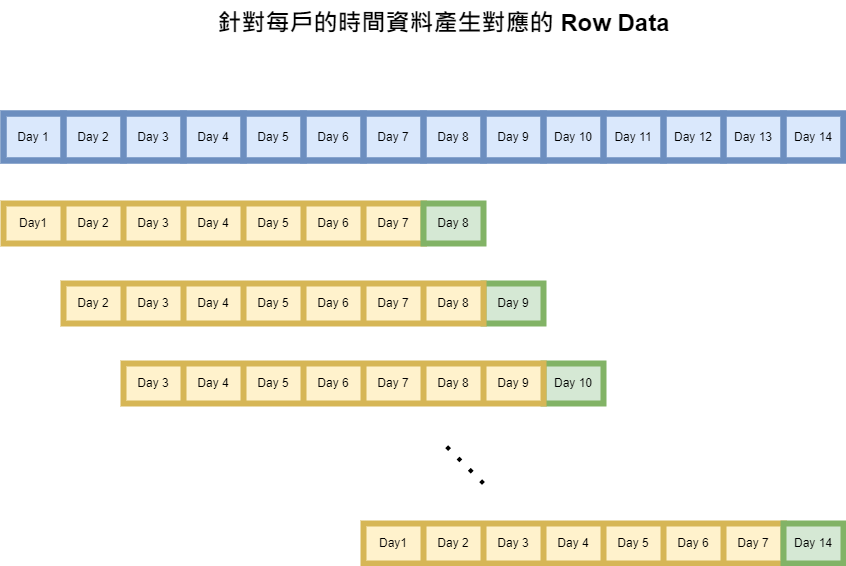
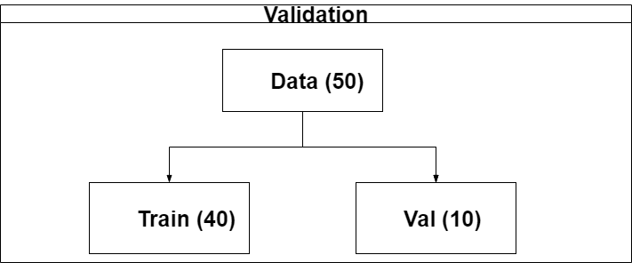
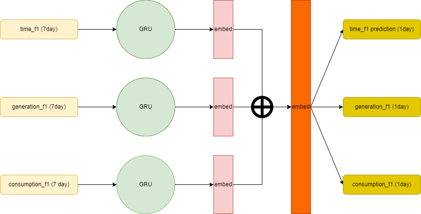
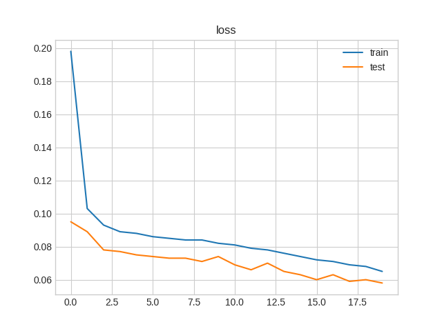
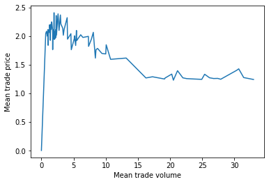
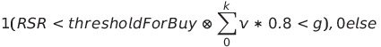
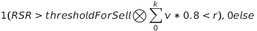

# Energy trader

### Introduction

### Model

## 資料前處理

作業中的 training_data 是將每戶 2018/01/01 - 2018/08/31 用電的資訊以 csv 檔案格式個別存放，時間單位是 hour 。因為作業的問題是希望透過過去七天的訊息，來產生下一天的預測結果。因此在建構訓練數據的流程是將時間序列的資料以每 7+1 天的範圍來擷取，前七天當作 feature ，第八天當作 target ，示意圖如下。時間單位則是將一天 24 小時分成 4 時段，讓時間的變數可以數值化，當作訓練時的特徵使用。

 

對於數據採用 min-max Scale 作法將數據限制在 [-1, 1] 區間。
本次作業使用 3 種特徵數據，編號以及對應描述如下所示。

- time_f1: min-max scale after (hour / 6)
- generation_f1: min-max scale generation column
- consumption_f1: min-max scale consumption column

## 驗證資料

訓練模型的時候，我需要從中切出一部分當作假的測試資料，用於評估是否有辦法抓到模式。訓練資料總共有 50 戶的用電資料，所以從中切出 20% 的用戶當作驗證資料。

## 模型架構

模型的輸入有 time_f1, generation_f1, consumption_f1 三種特徵，輸出也是，差別在於輸入是七天的時間的特徵，輸出是一天的時間的預設數值。

##  實驗結果

使用 Adam 優化器進行訓練，訓練時使用的 loss function 皆採用 MSE 來進行優化。對於損失的計算，對 generation_f1 以及 consumption_f1 增加 50% 的損失權重。初步可以看到訓練集的損失曲線有往下的趨勢，意味過程中有抓到資料的 pattern ，另外從驗證集上也可以看到下降的趨勢，所以在驗證集上也是有抓到相同的 pattern 。

##  模型輸出

固定上述使用的參數，將所有的訓練資料用於模型的訓練，並儲存成 .pt 檔案。

##  用於測試資料

路徑都不要改，使用 `python test.py` 指令可以獲得測試資料下一天的預測結果。

### Agent

## Preprocess
1. 計算 供需比 (request- supply rate, RSR)
    1) Idea: 價格根據供需比在變動。 供需比的公式如下： 需求量/ 供應量。 如果供需比顯示較高的值表示需求量大，供應量少， 價格趨向高， 相反的， 需求量少， 供應量大， 則呈現較小的值， 價格趨向低。
    Reference url: https://www.youtube.com/watch?v=PHe0bXAIuk0

    2) 我們試著找出在BID information裡的供需比， 公式如下： sum(generate of all familys)/ sum(consumption of all familys)。

    3) 以下為顯示不同時段、不同星期下的供需比的範例。 
    

    | Weekday | Hour     | Request-Supply rate |  
    |---------|----------|----------------------|
    | 5       | 00:00:00 | 835.68               |   
    | 5       | 01:00:00 | 333.27               | 
    | 5       | 02:00:00 | 118.87               | 

2. 計算不同時間、 不同星期的平均交易量與平均成交價格
    1) 我們計算在不同時段、 不同星期的平均交易量與平均成交價格。
    2) 以下為顯示不同時段、 不同星期的平均交易量與平均成交價格範例。 以上兩筆與下兩筆為對照， 可以看到在特定時段、特定星期的交易量與交易價格成反比，交易量越多成交價格越低， 相反的交易量越少， 成交價格越高。 

    | Weekday | Hour     | Mean trade volume | Mean trade price |   
    |---------|----------|-------------------|------------------|
    | 1       | 15:00:00 | 0.192             | 2.241            |   
    | 2       | 16:00:00 | 0.186             | 2.257            |   
    | 6       | 20:00:00 | 16.318            | 1.668            |   
    | 4       | 22:00:00 | 20.932            | 1.763            |   

    3) 下圖顯示交易量與成交價格的關係。 可以看到交易量與交易價格成反比。
    

3. 預測target日期的產出與消耗
    1) 先從Model 預測出target日期的產出與消耗。
    3) 計算每個時段產出的總和與消耗的總和。 
    
4. 價格策略
    1) 參考價格使用目標時段，目標星期的平均價格。
    2) 售出出價範圍= 參考價格* 範圍0.9到1.2作為折扣， step= 1， 作為售出出價範圍。 買價出價範圍=  參考價格* 範圍1.0到1.4作為折扣， step= 1， 作為買進出價範圍。 
    

5. 數量策略
    1) 使用產出的總和作為參考數量， 並且在特定時段出現較低的供需比時買進。 買進數量= 目標時段與星期的平均交易數量* 0.8。
    2) 使用手中持有的剩餘能源作為參考數量， 並且在特定時段出現較高的供需比時賣出。 剩餘能源= (產出的總和+ 購買的總和) - 消耗的總和。 這個值會在 * 0.8 避免售出過量的剩餘於能源， 導致需另外購買。
    
    
6. 動作策略
    1) 先計算完可能觸發買進動作的所有時段與價格與數量。 得到所有的買進動作。 Trigger: 如果在特定時段供需比低於一個threshold for buy啟動buy action. 直到買進數量總和> 產出的總和 則停止。
    
       買進動作 k, 目標時段與星期的平均交易數量 v, 買進數量 v* 0.8, 產出的總和 g
           
       

       

    2) 計算完可能觸發的所有買進動作後， 計算可能觸發的所有賣出動作， Trigger: 如果在特定時段供需比高於一個threshold for sell， 啟動sell action. 直到賣出數量總和>剩餘數量則停止。
       買進動作 k, 目標時段與星期的平均交易數量 v, 買進數量= v* 0.8, 買進的總和 b, 賣出的總和 s, 產出的總和 g, 消耗的總和 c, 剩餘 r= g+ b- c

       

    3) 我們找出所有的供需比裡10 percentile的最小值作為threshold for buy, 所有的供需比裡70 percentile的最大值作為threshold for sell。
    

7. 透過BID information 增加利潤的方式
    1) 如1. 2) 提到， 找出在BID information裡的供需比。 根據BID information裡找出的供需比決定什麼時段能夠以較低的價格買進， 及較高的價格賣出。

